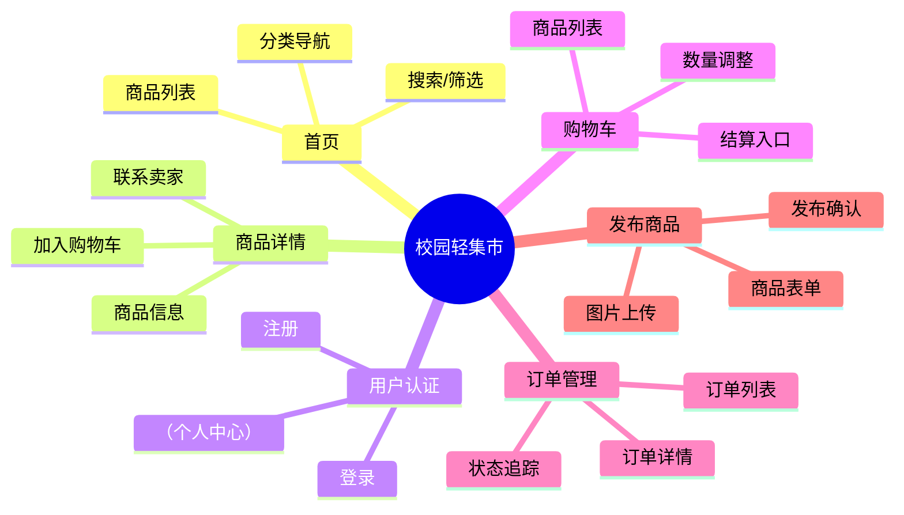
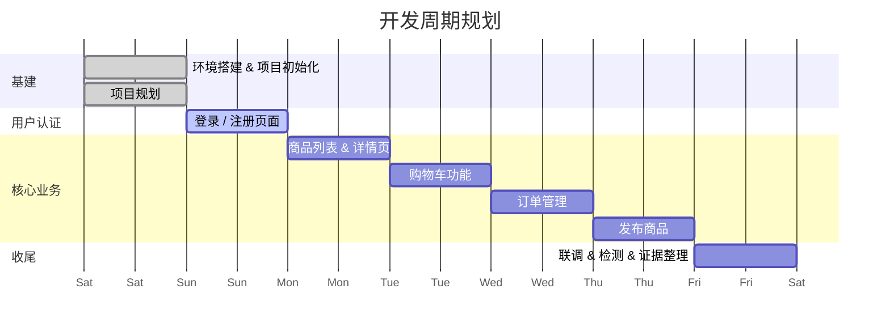

# 校园轻集市 — 项目规划

## 一、页面清单

| 页面 | 路由路径 | 说明 |
|------|----------|------|
| 首页 / 商品列表 | `/` | 展示全部商品，支持搜索、分类筛选 |
| 商品详情 | `/goods/:id` | 查看单个商品的详细信息 |
| 登录 | `/login` | 用户登录 |
| 注册 | `/register` | 用户注册 |
| 购物车 | `/cart` | 管理待购买商品 |
| 订单列表 | `/orders` | 查看我的订单 |
| 订单详情 | `/orders/:id` | 查看单个订单状态 |
| 发布商品 | `/publish` | 发布新商品出售 |
| 个人中心 | `/profile` | 用户信息管理（扩展选做） |

---

## 二、功能模块

### 模块 1：用户认证（Auth）
- 登录 / 注册表单
- 表单校验（手机号/邮箱、密码强度）
- Token 存储与拦截器
- 退出登录

### 模块 2：商品浏览（Goods）
- 商品卡片列表展示
- 关键词搜索
- 分类筛选（学习用品、二手数码、生活用品等）
- 商品详情页

### 模块 3：购物车（Cart）
- 加入购物车
- 购物车列表（数量增减、删除）
- 全选 / 反选
- 结算价格汇总

### 模块 4：订单管理（Order）
- 提交订单（从购物车生成）
- 订单列表（按状态分类：待支付 / 已支付 / 已完成）
- 订单详情

### 模块 5：商品发布（Publish）
- 商品信息表单（标题、描述、价格、分类、图片）
- 图片预览与上传
- 发布确认

---

## 三、开发顺序（7 天规划）

| 天数 | 任务 | 产出 |
|------|------|------|
| **Day 1** | 环境配置 + 项目结构分析 + 项目规划 | 开发环境就绪，本文档 |
| **Day 2** | 用户认证（登录 / 注册页面 + 路由 + 状态管理） | `LoginView.vue`、`RegisterView.vue`、Auth Store |
| **Day 3** | 商品列表 + 商品详情（API 对接 + 页面渲染） | `GoodsListView.vue`、`GoodsDetailView.vue` |
| **Day 4** | 购物车（增删改查 + 全选 + 结算汇总） | `CartView.vue`、Cart Store |
| **Day 5** | 订单管理（提交订单 + 订单列表 + 详情） | `OrderListView.vue`、`OrderDetailView.vue`、Order Store |
| **Day 6** | 发布商品（表单 + 图片上传） | `PublishView.vue` |
| **Day 7** | 联调测试 + Lint 检查 + 证据卡归档 | 最终可运行项目 |

---

## 四、开发重点

### 1. 组件复用性设计
商品卡片、表单输入、列表页等公共 UI 应抽取为通用组件放入 `components/`，避免每个页面重复造轮子。

### 2. 路由守卫与权限控制
未登录用户访问购物车 / 订单 / 发布页面时应自动跳转登录页，需在 `router/index.ts` 中配置全局前置守卫。

### 3. Pinia 状态设计
- **Auth Store**: 用户信息、Token、登录状态
- **Cart Store**: 购物车列表、选中状态、总价计算
- **Goods Store**: 商品列表、搜索条件、分页
- **Order Store**: 订单列表、订单详情

### 4. API 层的封装
所有请求统一在 `src/api/` 中管理，配合 Axios 拦截器实现 Token 注入、错误处理、Loading 态。

### 5. TS 类型安全
为商品、订单、用户等核心数据定义 TypeScript 接口（`types/` 目录），贯穿全项目使用。

### 6. AI 协作记录习惯
每次 Prompt → AI 输出 → 采纳/修改 → 验证，按规范记录到 Evidence 文档中，保留完整过程证据。
